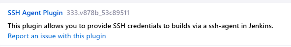

1. **Launch an EC2 Instance:**
   You'll run Jenkins on an Amazon EC2 (Elastic Compute Cloud) instance. Follow these steps to create an EC2 instance:
   - Log in to the AWS Management Console.
   - Go to the EC2 Dashboard.
   - Click "Launch Instance."
   - Choose an Amazon Machine Image (AMI), in our case it is ubuntu 20.04
   - Select an instance type based on your requirements. A t2.micro instance is a good starting point for small projects.
   - Select your vpc and make sure to select public subnet.
   - Configure the security group to allow SSH (port 22), HTTP (port 80) and TCP (port 8080) for access.

2. **Connect to Your EC2 Instance:**
   - Connect to your ec2 instance using the command given by amazon
     ```
     ssh -i your-key.pem ec2-user@your-instance-ip
     ```

3. **Install Jenkins:**
   On your EC2 instance, you need to install Jenkins.

   ```bash
   sudo apt update
   sudo apt install openjdk-11-jdk
   wget -q -O - https://pkg.jenkins.io/debian-stable/jenkins.io.key | sudo apt-key add -
   sudo sh -c 'echo deb https://pkg.jenkins.io/debian-stable binary/ > /etc/apt/sources.list.d/jenkins.list'
   sudo apt update
   sudo apt install jenkins
   ```

   After installing Jenkins, start the Jenkins service:

   ```bash
   sudo systemctl start jenkins
   sudo systemctl enable jenkins
   ```

4. **Access Jenkins:**
    Use your browser to access Jenkins by navigating to `http://your-instance-ip:8080`. You'll need to retrieve the Jenkins unlock key from the server's log files to complete the initial setup. `sudo cat /var/lib/jenkins/secrets/initialAdminPassword`

5. **Admin account**

    You can either create an account or skip and log in as admin.


### Creating an environment

This is how we will configure our jenkins, but for this case we will use the suggested plugins as these are all we need. However we need to add two more plugins. While on the dashboard, click on manage jenkins and select plugins. Go to available plugins and search for ssh agent, we will need this later on. Next we need to install the office 365 connector plugin in too.



We need to also configure the gitbash terminal to work with github.

`sudo su - jenkins`

`ssh-keyscan github.com >> ~/.ssh/known_hosts`

This will add github to a known host list and allow jenkins to connect to it.

## Creating pipeline.

Now we are on the main page we can begin to create our job.
