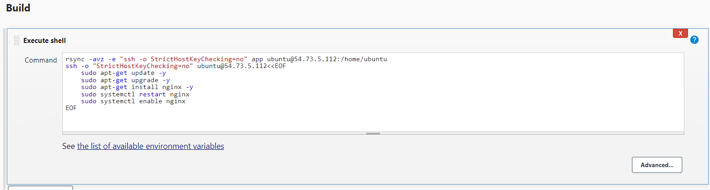

## Setting up a jenkins CD Job

### First we need to create an ec2 instance.

Create an ec2 instance as we have normally done, and make sure it is a fresh AMI of ubuntu linux 20.04. Select the correct security group and launch the instance.

### Creating the jenkins job.

Create a new item and call it yourname-cd-254.

We want the usual settings that we normally use, so discard old builds, restrict where project can be run and select the correct SSH agent. 

It is important to select "build after other projects are built" and select the merge job. This will deploy our app following a successful test and merge of our code.

An important step is to enter the correct shell commands. In the build section, select execute shell. 

 The `rsync` command copies the "app" directory to a remote server (`ubuntu@54.73.5.112`) using SSH. The option `-o StrictHostKeyChecking=no` disables host key checking, but it's not recommended for security.

The `ssh` command connects to the same remote server with host key checking disabled and runs these commands:
   - Updates package repositories.
   - Upgrades installed packages.
   - Installs Nginx.
   - Restarts Nginx.
   - Enables Nginx to start automatically.

### Launch the app

Create a separate job which we will use to launch the app. The settings remain same as before, the big change is in the execute shell.
This code is a shell script that uses SSH to connect to an EC2 instance and launches a nodejs app.

1. `ssh -A -o "StrictHostKeyChecking=no" ubuntu@54.73.5.112 <<EOF`: This initiates an SSH connection to the specified EC2 instance (`ubuntu@54.73.5.112`) with agent forwarding enabled (`-A`) and host key checking disabled (`-o "StrictHostKeyChecking=no"`). 

2. `curl -sL https://deb.nodesource.com/setup_12.x | sudo -E bash -`: This line installs Node.js on the remote server by fetching and executing a script from nodesource.com. It sets up Node.js version 12.x.

3. `sudo apt install nodejs -y`: Installs Node.js on the server using the package manager. The `-y` flag automatically answers "yes" to any prompts.

4. `sudo npm install pm2 -g`: Installs the Process Manager 2 (PM2) globally using `npm`.

5. `cd app`: Changes the directory to the "app" folder on the remote server.

6. `npm install`: Installs Node.js dependencies.

7. `pm2 start app.js`: Starts the Node.js application named "app.js" using PM2.

