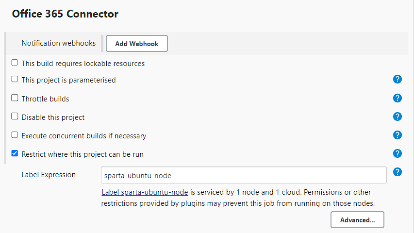
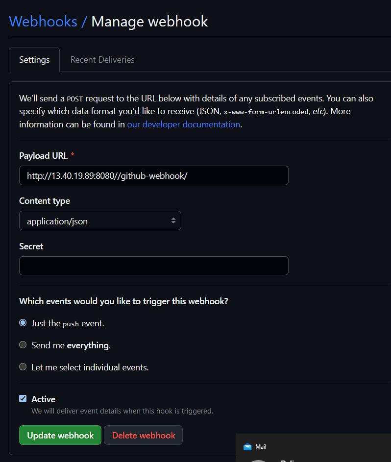
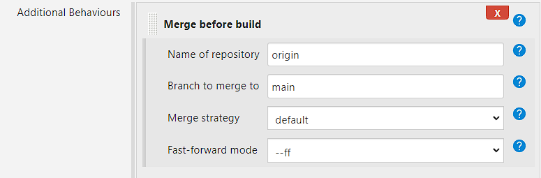
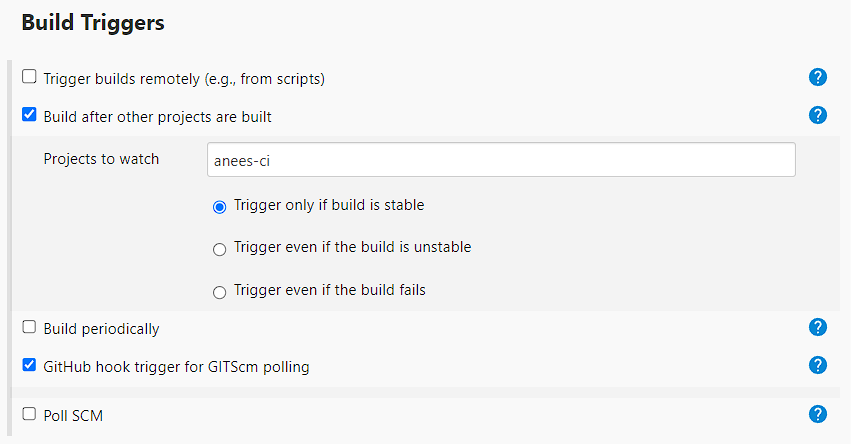
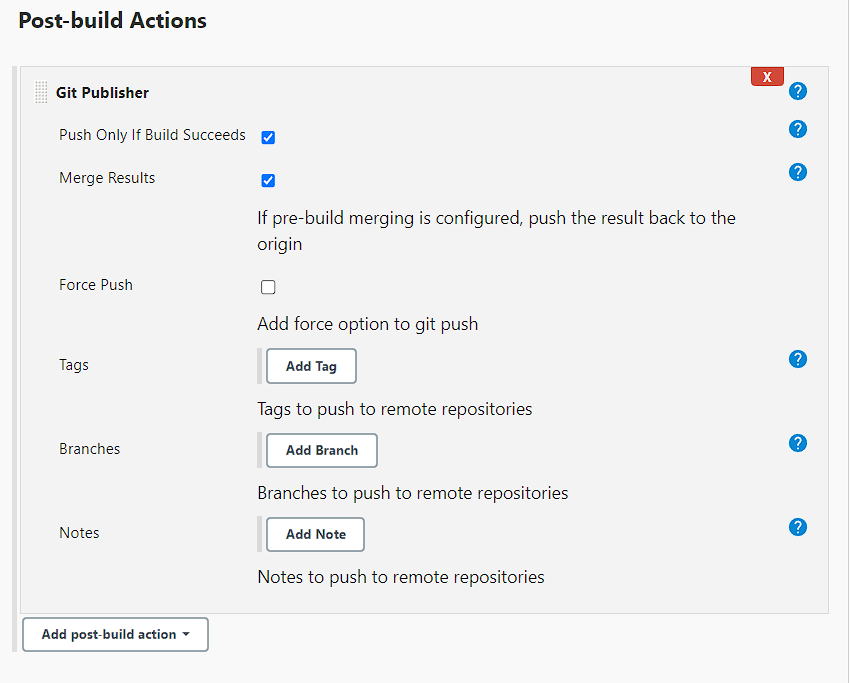
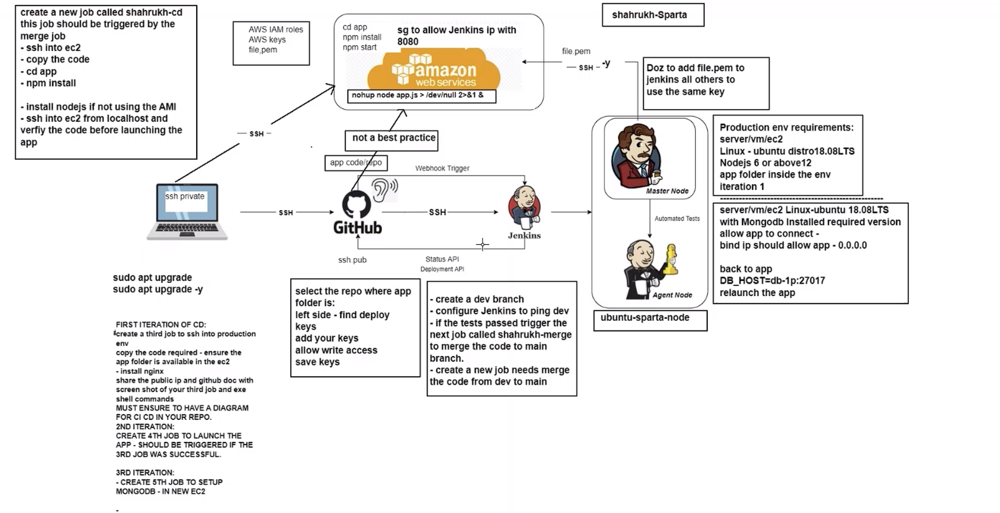

# Setting up Jenkins

## Create SSH Key Pair

1. First, create a new SSH key pair. These keys will be used for authenticating with Jenkins.

2. Go to your GitHub repository, navigate to "Settings," and select "Deploy Keys."

3. Paste your public key and ensure that write access is granted.

## Create a New Jenkins Job

4. In Jenkins, create a new job by selecting "New Item" and choose a "Freestyle Project."

5. Return to GitHub, copy the HTTP URL of your repository, and select "GitHub Project" in your Jenkins job configuration. Paste the URL there.

6. In the Office 365 Connector, select "Restrict where this project can be run" and enter "sparta-ubuntu-node." This ensures that all tests run on the test node.

## Configure Source Code Management

7. Under "Source Code Management," select Git and provide the SSH URL of your repository. Choose the SSH private key from the dropdown and give it a username that helps identify it in the future. Paste in the private key.

8. Make sure to select "GitHub hook trigger" in the build triggers.

## Set Build Environment

9. Choose "Provide Node" in the build environment and select the SSH agent. Choose "tech254.pem."

10. Go to the build section and press "Execute Shell." Enter the following commands to run the tests.

## Setting up a Webhook

11. Configure a webhook to listen for pushes. This will trigger a test run each time you push code. The payload URL is the URL of your jenkins IP. Set the content type to json.

# Merge to Main

## Copy the Template

12. Copy the template created above and make a few changes for the merge job.

13. In the source code management section, select "Add Additional Behaviors" and scroll down to "Merge Before Build." After a successful test, you'll want this job to run.

14. In build triggers, select "Build after other projects are built." This will run the merge job after the test job has completed.

15. **Remove the shell script** as it's not needed in this job. Add Git Publisher and select "Merge Result."

### Launching to AWS Plan

Before we start we need to complete a few pre requisites.

1. **Setup Jenkins:**
   - Ensure that Jenkins is properly installed and configured in your environment. If you haven't already, you may need to set up a Jenkins server and have it running.

2. **Access to an EC2 Instance:**
   - Ensure that you have access to an EC2 instance on which you intend to deploy your application. You should have the necessary permissions and SSH access to this instance.

3. **GitHub Repository:**
   - You need a GitHub repository where your code is hosted. Make sure you have the correct access to this repository as you'll be configuring webhooks and access keys.

4. **SSH Key Pair:**
   - Generate an SSH key pair if you don't have one already. You'll use this key pair for authenticating Jenkins to your EC2 instance.

5. **GitHub Deploy Key:**
   - Add the public key of the SSH key pair to your GitHub repository as a deploy key. Ensure it has write access to the repository.

6. **Node.js Installation:**
   - Determine whether you need to install Node.js on your EC2 instance or if you'll be using an Amazon Machine Image (AMI) that already has Node.js installed.

7. **Test Scripts:**
   - Prepare the necessary test scripts and build scripts for your application, as these will be part of your CI/CD process.

8. **Permissions and Credentials:**
    - Make sure you have the appropriate permissions and credentials to access GitHub, Jenkins, and your EC2 instance. This includes any SSH keys and credentials required for authentication.

9. **Network Configuration:**
    - Ensure that network configurations allow Jenkins to communicate with your GitHub repository and the EC2 instance, including any necessary firewall rules.

10. **Backup and Recovery Plan:**
    - Consider setting up backup and recovery mechanisms, as well as error-handling procedures in your CI/CD process.

The plan consists of 10 tasks.

#### Task 1: Create a New Jenkins Job
1. Click "New Item" to create a new Jenkins job.
2. Enter the name "your_name-cd" for the job.

#### Task 2: Trigger the New Job from Your Merge Job
1. In your existing Jenkins job (Merge job), add a post-build action to trigger the "your_name-cd" job.
2. Configure this action to run when the Merge job succeeds.

#### Task 3: Allow Jenkins to SSH into Your EC2 Instance
1. Set up SSH access for Jenkins to your EC2 instance.
2. Ensure that Jenkins has the necessary SSH key or credentials to access the instance.

#### Task 4: Add the -y Command for SSH Access
1. Modify your SSH command to include the `-y` option to automatically confirm without the need for user interaction.
   
#### Task 5: Copy the App Code
1. Use a build step in your "your_name-cd" job to copy the application code to the EC2 instance. We can use github clone.
   
#### Task 6: Change to the App Directory
1. Add a build step to navigate to the directory where the app code was copied on the EC2 instance using the `cd` command. 

#### Task 7: Install Node.js (or Use an AMI)
1. Either install Node.js on the EC2 instance via build steps or use an AMI that already has Node.js installed.

#### Task 8: Run npm install
1. Include a build step to execute `npm install` within the app directory on the EC2 instance to install project dependencies.
   
   
#### Task 9: Verify the Code via SSH
1. Set up an SSH connection from Jenkins to your EC2 instance. Test the code once connected.

#### Task 10: Modify the App Name
1. Add a build step to update the name of the Sparta app to "your_name - Sparta" within the app code. We can use `sed` command to do this.

## Diagram of entire process

Below is the entire process we have just set up, from start to end. 

We began by creating a webhook listener that will wait until we pushed to ou github repo

Once we did, github then passes the code to jenkins.

Jenkins will take the code and test it on one of the agent nodes.

Due to the way we have set up our pipeline, if all tests pass, the code will then be merged with the main branch. It will then be deployed to the web server where it is hosted.

