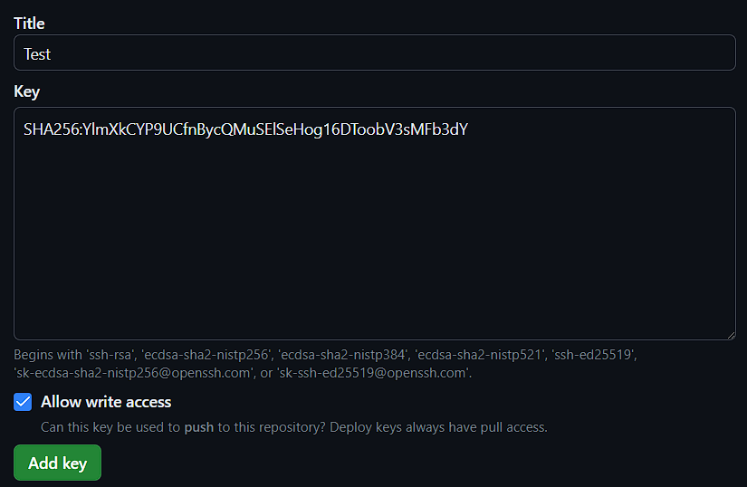
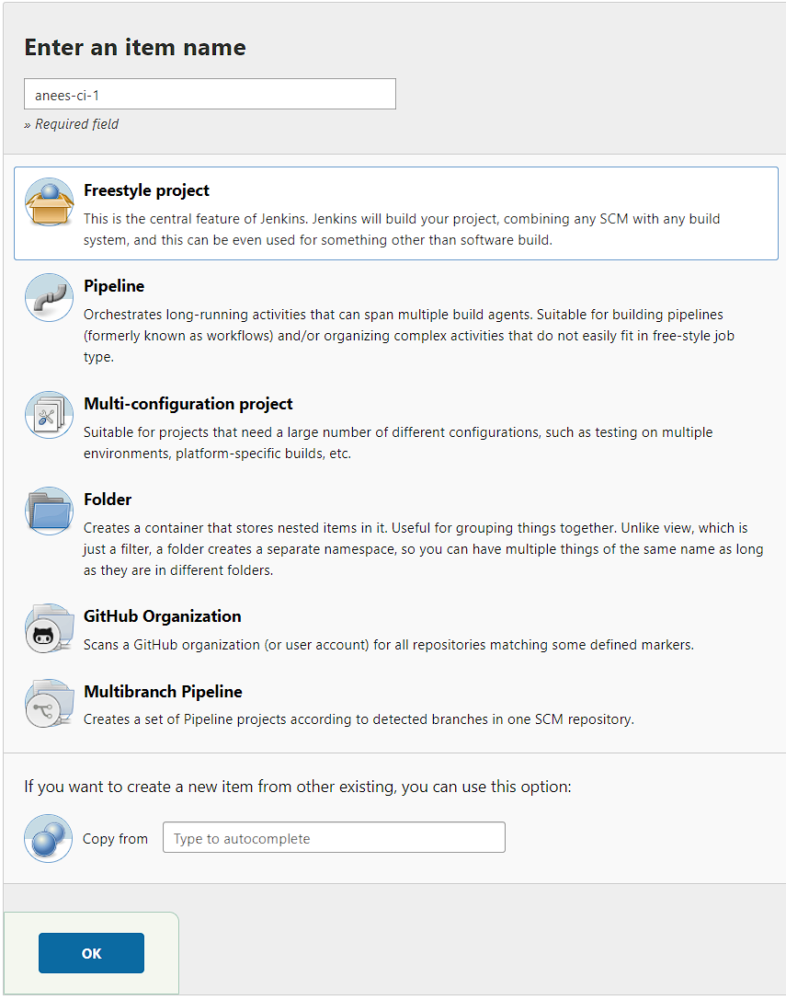
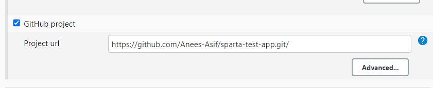
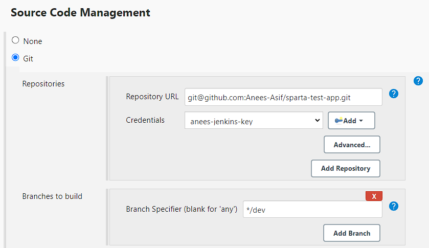
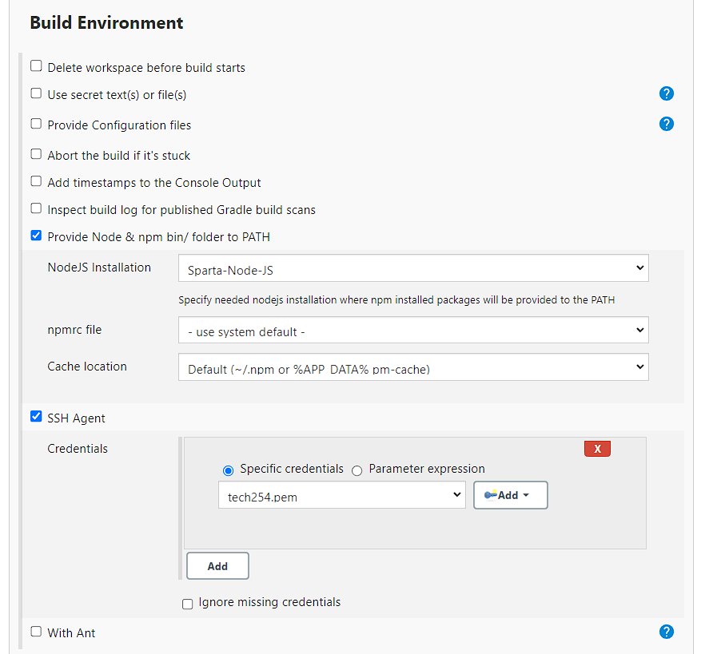
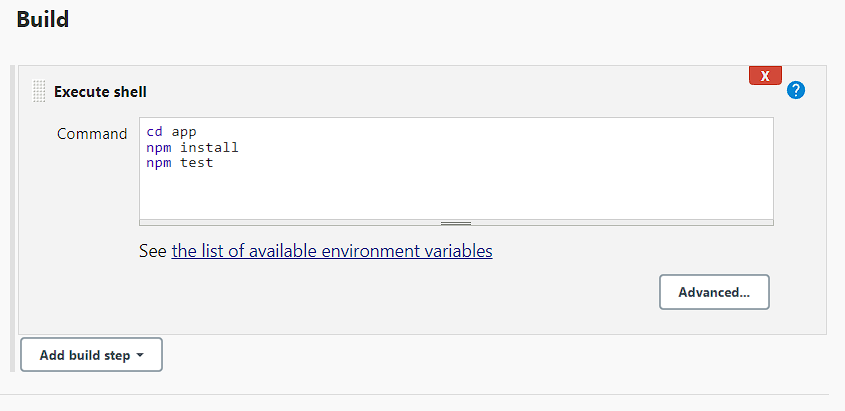

webhook always listening
status api development api

as code is pushed, it is ssh to jenkins.

Master node main server, use agent node to test code

Node = vm

If code passed, jenkins passes code to production.

Create job - freestyle

Discard old builds - stops overloads.  Max builds - 3

whoami
uname -a

go to dashboard- dropdown- build

build history shows output

## Setting up jenkins

First we need to create a new ssh key pair, these will be used when authenticating with jenkins.

Go to the repo and go to settings and select deploy keys. Paste in public key and make sure to give write access

Go to jenkins and create a new item and choose freestyle project:

 Go back to github and copy http of repo and select github project and paste it in there

 

Next for source code managment select git and paste in ssh url of the repo. Select the ssh private key dropdown and give a username that will help you identfiy in the future and paste in the private key.

Make sure to select **github hook trigger** in build triggers

Choose **provide node** in build enviroment and select SSH agent and select tech254.pem

Finally go to build and press execute shell. Enter the following commands, this will run the test

